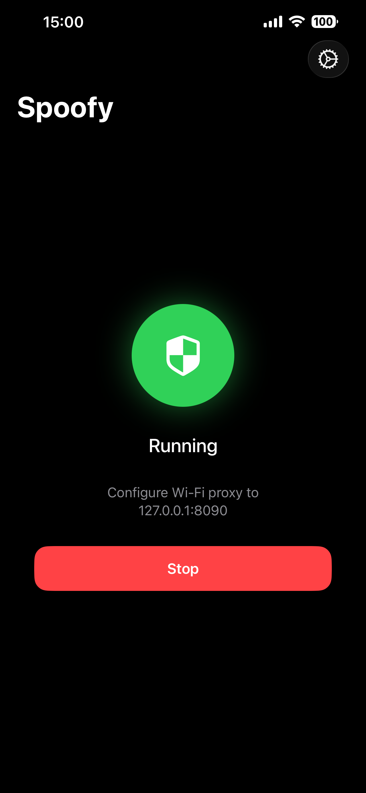
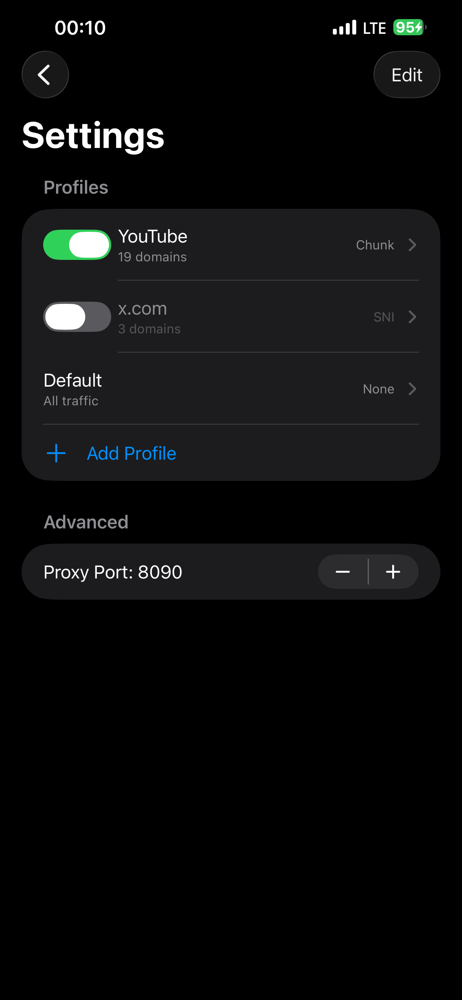
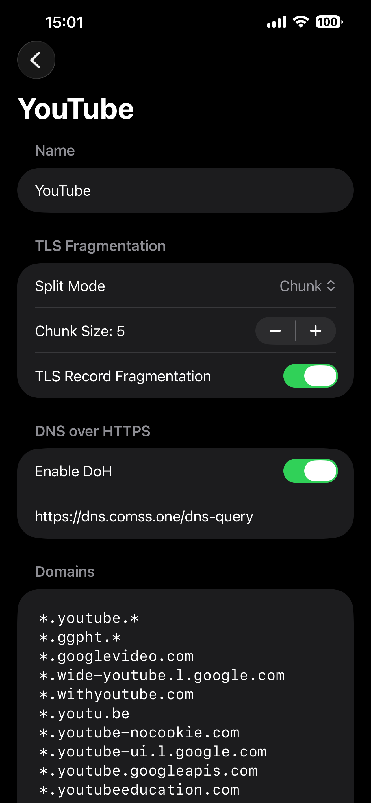

# Spoofy

A native iOS DPI (Deep Packet Inspection) bypass tool inspired by [SpoofDPI](https://github.com/xvzc/SpoofDPI).

Spoofy runs a local proxy that intercepts HTTPS connections and fragments TLS ClientHello packets, preventing DPI engines from reading the SNI (Server Name Indication) and blocking your traffic.

> ⚠️ This project is fully vibe-coded.

<p align="center">
  
  
  
</p>

## How It Works

1. Spoofy starts a local HTTP/HTTPS proxy server on your device (default port `8090`)
2. When an HTTPS connection is made, the proxy intercepts the TLS ClientHello
3. The ClientHello is fragmented using the configured split strategy so that DPI cannot reconstruct the SNI field from a single packet
4. Each fragment is sent as a separate TCP packet (`TCP_NODELAY`) to defeat reassembly
5. The remaining traffic is relayed transparently

## Features

- Multiple TLS fragmentation strategies (SNI, Chunk, Random, FirstByte)
- TLS record fragmentation for additional obfuscation
- DNS-over-HTTPS (DoH) to prevent DNS-based blocking
- Per-domain profiles with wildcard pattern matching

---

## Configuration Guide

### Proxy Port

The port on which the local proxy server listens. Default is `8090`. You can change it to any value between `1024` and `65535`. Only change this if the default port conflicts with something else.

### Profiles

Spoofy uses a profile system to apply different bypass strategies to different domains.

#### Master Profile

The **Master** (default) profile applies to all traffic that doesn't match any other profile. It is always present and cannot be deleted. Configure this with settings that work for all of your sites.

#### Custom Profiles

You can create additional profiles for specific domains that need different settings.

Domain patterns support wildcards:
| Pattern | Matches |
|---|---|
| `*.example.com` | `www.example.com`, `api.example.com`, etc. |
| `example.*` | `example.com`, `example.org`, etc. |
| `*.youtube.*` | `www.youtube.com`, `m.youtube.co.uk`, etc. |

### Split Mode

The core setting that determines how the TLS ClientHello packet is fragmented. Available modes:

| Mode | Description | When to Use |
|---|---|---|
| **SNI** | Splits each character of the hostname into a separate TCP packet | Most effective against SNI-based DPI. Try this first. |
| **Chunk** | Splits the ClientHello into fixed-size chunks | Use when SNI mode doesn't work. Adjust chunk size (1–1000 bytes). |
| **Random** | Applies random pattern-based splitting | Alternative when other modes are detected. |
| **FirstByte** | Sends the first byte separately, then the rest | Lightweight option, may work against simple DPI. |
| **None** | No fragmentation, plain relay | Use for domains that don't need bypassing. |

**Recommendation:** Start with **SNI** mode. If it doesn't work, try **Chunk** with a small chunk size (e.g., 1–5 bytes).

### TLS Record Fragmentation

An additional layer of obfuscation. When enabled, the TLS handshake message is wrapped across multiple TLS records *before* the split mode is applied. This can help bypass DPI that reassembles TLS records before inspecting them.

**Recommendation:** Enable this if your chosen split mode alone doesn't work.

### DNS-over-HTTPS (DoH)

When enabled, DNS queries are sent over HTTPS instead of plain DNS, preventing your ISP or network from seeing which domains you're resolving.

- **DoH Server URL** — the DoH endpoint to use (default: `https://1.1.1.1/dns-query`)

**Recommendation:** Enable this if your ISP blocks domains at the DNS level.

---

## Setting Up Wi-Fi Proxy on iPhone

You need to manually configure your iPhone's Wi-Fi proxy settings to route traffic through Spoofy.

### Steps

1. **Start Spoofy** — open the app and tap the start button to begin the proxy server
2. Open **Settings** on your iPhone
3. Tap **Wi-Fi**
4. Tap the **ⓘ** icon next to your connected Wi-Fi network
5. Scroll down to **HTTP Proxy** and tap **Configure Proxy**
6. Select **Manual**
7. Enter the following:
   - **Server:** `127.0.0.1`
   - **Port:** `8090` (or whatever port you configured in Spoofy)
   - **Authentication:** leave off
8. Tap **Save**

### Disabling the Proxy

When you stop using Spoofy, remember to disable the proxy:

1. Go to **Settings → Wi-Fi → ⓘ (your network) → HTTP Proxy**
2. Change back to **Off**

---

## AltStore

Source: https://raw.githubusercontent.com/ringolol/Spoofy/main/altstore/altsource.json

---

## App Store & VPN Mode

Spoofy is **not available on the App Store** and does not support VPN mode. Both require an Apple Developer Program membership ($99/year), which the developer does not have. Because of this:

- **No App Store distribution** — you need to build the app yourself with Xcode and sideload it onto your device (e.g., using a free Apple ID or [AltStore](https://altstore.io/)). The license permits anyone with a Developer account to publish Spoofy on the App Store.
- **7-day expiration** — builds signed with a free Apple ID expire after 7 days and need to be re-installed.
- **No VPN mode** — iOS Network Extensions (which enable system-wide VPN-based proxying) require entitlements that are only available through the paid Developer Program. Instead, Spoofy works as a local proxy that you connect to via Wi-Fi proxy settings.

---

## Building
### Requirements
- iOS 15.0+
- Xcode 15+

### Steps
1. Clone the repository
2. Open `Spoofy.xcodeproj` in Xcode
3. Set your development team and update the bundle identifier to match your team
4. Build and run on your device

---

## Example Profile: YouTube

A ready-to-use profile for unblocking YouTube:

| Setting | Value |
|---|---|
| **Split Mode** | Chunk |
| **Chunk Size** | 5 |
| **TLS Record Fragmentation** | On |
| **Enable DoH** | Yes |
| **DoH Server URL** | `https://dns.comss.one/dns-query` |

**Domains** (one per line):
```
*.youtube.*
*.ggpht.*
*.googlevideo.com
*.wide-youtube.l.google.com
*.withyoutube.com
*.youtu.be
*.youtube-nocookie.com
*.youtube-ui.l.google.com
*.youtube.googleapis.com
*.youtubeeducation.com
*.youtubeembeddedplayer.googleapis.com
*.youtubefanfest.com
*.youtubegaming.com
*.youtubego.*
*.youtubei.googleapis.com
*.youtubekids.com
*.youtubemobilesupport.com
*.yt.be
*.ytimg.com
```
