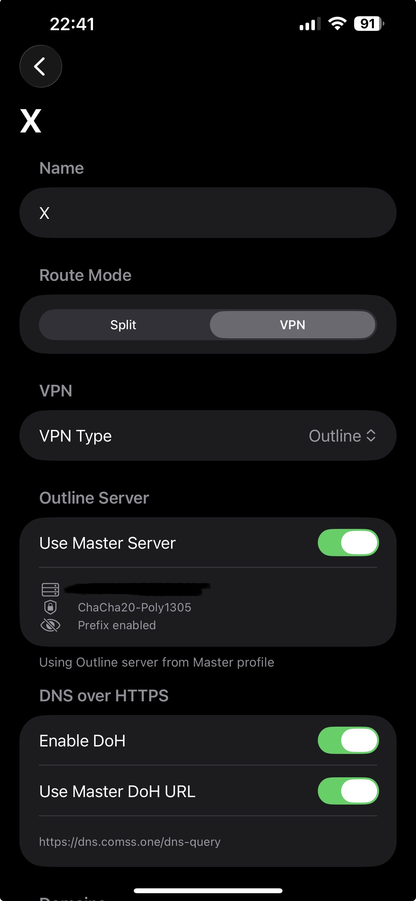

# Spoofy

A native iOS DPI (Deep Packet Inspection) bypass tool inspired by [SpoofDPI](https://github.com/xvzc/SpoofDPI).

Spoofy runs a local proxy that intercepts HTTPS connections and fragments TLS ClientHello packets, preventing DPI engines from reading the SNI (Server Name Indication) and blocking your traffic.

> ⚠️ This project is fully vibe-coded.

<p align="center">
  
  
  
  
</p>

## How It Works

1. Spoofy starts a local HTTP/HTTPS proxy server on your device (default port `8090`)
2. When an HTTPS connection is made, the proxy intercepts the TLS ClientHello
3. The ClientHello is fragmented using the configured split strategy so that DPI cannot reconstruct the SNI field from a single packet
4. Each fragment is sent as a separate TCP packet (`TCP_NODELAY`) to defeat reassembly

## Features

- TCP and TLS fragmentations to prevent DPI blocking
- DNS-over-HTTPS to prevent DNS-based blocking
- Outline server support — route matched domains through an Outline server
- Per Domain Profiles. Allows to precisely configure which rules work for which domain
- Export / Import settings
- LAN Server. Allows other devices on the same local network to connect to the proxy.

## Limitations

- **No system-wide VPN** — Spoofy only works over Wi-Fi and requires [manual proxy configuration](#setting-up-wi-fi-proxy-on-iphone). Cellular traffic is not covered. See [App Store & VPN Mode](#app-store--vpn-mode) for why.
- **No official App Store release** — you must sideload the app yourself or use the [AltStore source](#altstore). See [App Store & VPN Mode](#app-store--vpn-mode) for details.
- **Fully vibe-coded** — most of the code has never been reviewed by a human. Testing has been limited to running on a physical device and WireShark packet inspection. Use at your own risk.

---

## Configuration Guide

### Profiles

Spoofy uses a profile system to apply different bypass strategies to different domains.


#### Master Profile

The **Master** (default) profile applies to all traffic that doesn't match any other profile.

#### Custom Profiles

You can create additional profiles for specific domains that need different settings.

### Domain patterns

Support wildcards:
| Pattern | Matches |
|---|---|
| `*.example.com` | `www.example.com`, `api.example.com`, etc. |
| `example.*` | `example.com`, `example.org`, etc. |
| `*.youtube.*` | `www.youtube.com`, `m.youtube.co.uk`, etc. |

### Route Mode

Each profile has a **Route Mode** that determines how matched traffic is handled:

| Mode | Description |
|---|---|
| **Split** | DPI bypass — fragments TLS ClientHello using the configured split strategy (default) |
| **VPN** | Routes traffic through a VPN. For now only [Outline (Shadowsocks) server](#outline-server) is supported |

### Split Mode

The core setting that determines how the TLS ClientHello packet is fragmented. Available modes:

| Mode | Description | When to Use |
|---|---|---|
| **SNI** | Splits each character of the hostname into a separate TCP packet | Most effective against SNI-based DPI. Try this first. |
| **Chunk** | Splits the ClientHello into fixed-size chunks | Use when SNI mode doesn't work. Adjust chunk size (1–1000 bytes). |
| **Random** | Applies random pattern-based splitting | Alternative when other modes are detected. |
| **FirstByte** | Sends the first byte separately, then the rest | Lightweight option, may work against simple DPI. |
| **None** | No fragmentation, plain relay | Use for domains that don't need bypassing. |

**Recommendation:** Start with **SNI** mode. If it doesn't work, try **Chunk** with a small chunk size (e.g., 1–5 bytes).

### TLS Record Fragmentation

An additional layer of obfuscation. When enabled, the TLS handshake message is wrapped across multiple TLS records *before* the split mode is applied. This can help bypass DPI that reassembles TLS records before inspecting them.

**Recommendation:** Enable this if your chosen split mode alone doesn't work.

### Outline Server

When VPN type is set to **Outline**, traffic matching that profile's domains is routed through an [Outline](https://getoutline.org/)-compatible Shadowsocks server.

To configure Outline routing paste your Outline server's `ss://` access key into the **Server Configuration** field

**Recommendation:** Use Outline mode when you have access to an Outline server for domains where DPI bypass is not enough.

### DNS-over-HTTPS (DoH)

When enabled, DNS queries are sent over HTTPS instead of plain DNS, preventing your ISP or network from seeing which domains you're resolving.

- **DoH Server URL** — the DoH endpoint to use (default: `https://1.1.1.1/dns-query`)

**Recommendation:** Enable this if your ISP blocks domains at the DNS level.

### Advanced Options

#### Proxy Port

The port on which the local proxy server listens. Default is `8090`.

#### Allow LAN Access

When enabled, the proxy server binds to `0.0.0.0` instead of `127.0.0.1`, allowing other devices on the same local network to connect to the proxy. Disabled by default.

This is useful when you want to route traffic from another device (e.g., a computer or tablet) through Spoofy running on your iPhone. On the other device, set the HTTP proxy to your iPhone's local IP address and the configured port.

---

## Setting Up Wi-Fi Proxy on iPhone

You need to manually configure your iPhone's Wi-Fi proxy settings to route traffic through Spoofy.

### Steps

1. **Start Spoofy** — open the app and tap the start button to begin the proxy server
2. Open **Settings** on your iPhone
3. Tap **Wi-Fi**
4. Tap the **ⓘ** icon next to your connected Wi-Fi network
5. Scroll down to **HTTP Proxy** and tap **Configure Proxy**
6. Select **Manual**
7. Enter the following:
   - **Server:** `127.0.0.1`
   - **Port:** `8090` (or whatever port you configured in Spoofy)
   - **Authentication:** leave off
8. Tap **Save**

### Disabling the Proxy

1. Go to **Settings → Wi-Fi → ⓘ (your network) → HTTP Proxy**
2. Change back to **Off**

---

## AltStore

[AltStore](https://altstore.io/) source: https://raw.githubusercontent.com/ringolol/Spoofy/main/altstore/altsource.json

---

## App Store & VPN Mode

Spoofy is **not available on the App Store** and does not support VPN mode. Both require an Apple Developer Program membership ($99/year), which the developer does not have. Because of this:

- **No App Store distribution** — you need to build the app yourself with Xcode and sideload it onto your device (e.g., using a free Apple ID or [AltStore](https://altstore.io/)) or use the AltStore source provided. *Though the license permits anyone with a Developer account to publish Spoofy on the App Store.*
- **No VPN mode** — iOS Network Extensions (which enable system-wide VPN-based proxying) require entitlements that are only available through the paid Developer Program. Instead, Spoofy works as a local proxy that you connect to via Wi-Fi proxy settings.

---

## Building

### Requirements
- iOS 15.0+
- Xcode 15+

### Steps
1. Clone the repository
2. Open `Spoofy.xcodeproj` in Xcode
3. Set your development team and update the bundle identifier to match your team
4. Build and run on your device

---

## For Developers

### Releasing a New Version

```
make release VERSION=1.2 DESCRIPTION="Bug fixes and improvements"
```
Bumps the Xcode project version, archives the app, updates `altsource.json`, and creates a GitHub Release.

### Build and install to the Applications the macOS version

```
make install-macos
```
It tries to build and sign the app and then copy it to the Applications
